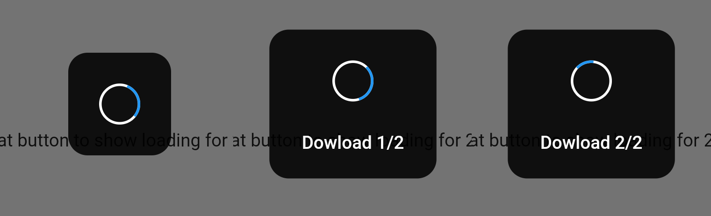

# loading
A Flutter package of loading progress

What are you locking for "loading progress"
- easy to use
- show loading when start
- hide loading when finish
- custom text, and updating in progress

# Demo
 

# Installation 
Add dependency to pubspec.yaml
```
dependencies:
  ...
  loading: 
    git: git://github.com/PingAK9/package-loading
```
Run in your terminal
```
flutter packages get
```

Or you can go to my github and copy the only file <a href="https://github.com/PingAK9/package-loading/blob/master/lib/loading.dart">loading.dart</a> to your project

## Example
```
void doSomething()async{
    showLoading(context);
    // await for do something
    await Future.delay(Duration(second: 2));
    hideLoading(context);
}
```