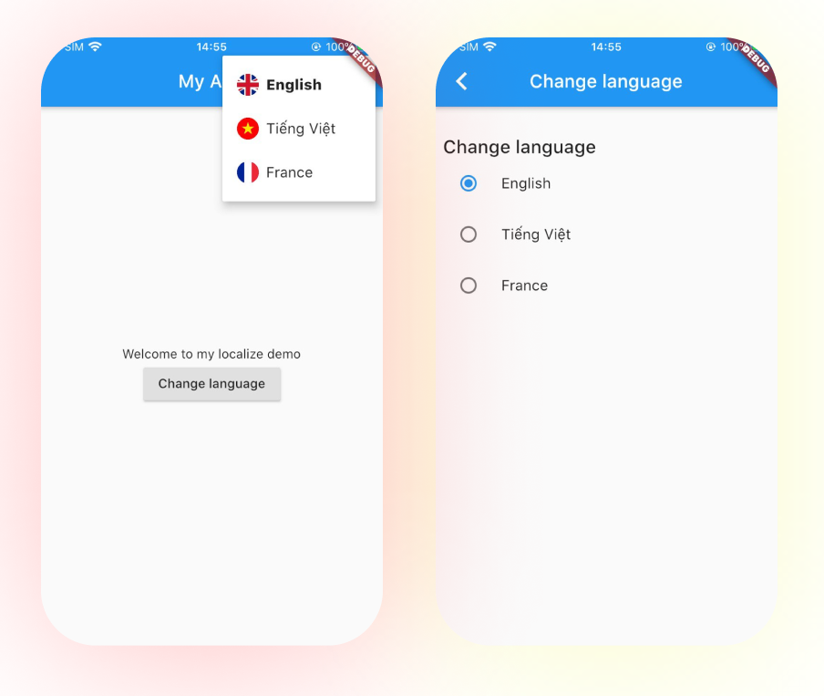

# My Localize

Localize Flutter package.

# Usage
## Init
First you need init your localize data: 
- List of locale,
- List of json files for each locale
- json files path
```dart
void main() {
  MyLocalize.instance.init(
    defaultLanguage:
        LocalizeData(code: "en", name: "English", files: ["common_en"]),
    path: "assets/json/",
    languages: [
      LocalizeData(code: "vi", name: "Tiếng Việt", files: ["common_vi"]),
      LocalizeData(code: "fr", name: "France", files: ["common_fr"]),
    ],
  );
  runApp(MyApp());
}
```
## Wrap localize widget
- For refresh after you change language
```dart
 WidgetLocalize(
  builder: (context, code) {
    return MaterialApp(
      localeResolutionCallback: (deviceLocale, supportedLocales) {
            return context.appTranslation?.locale ?? deviceLocale;
      },
      localizationsDelegates: [
        AppTranslationsDelegate.delegate,
      ],
      supportedLocales: MyLocalize.instance.supportedLocales(),
      home: MyHomePage(),
    );
  }
)
```
## Get text of current language
- Using the extension methods on [BuildContext]
```dart
context.text("title"); // get your localize text
context.format("message", [name]); // get your localize text with custom value like: phone, name, number
context.currentLanguage; // your current language code
```
## Change language
- Change your language manutly
```dart
await MyLocalize.instance.changeLanguage("en")
```
## Listen
```dart
StreamSubscription listenLanguageChange;
listenLanguageChange = MyLocalize.instance.onLocaleChanged.stream.listen((code) {
      // todo: handel here
    });
```

## Demo

 
